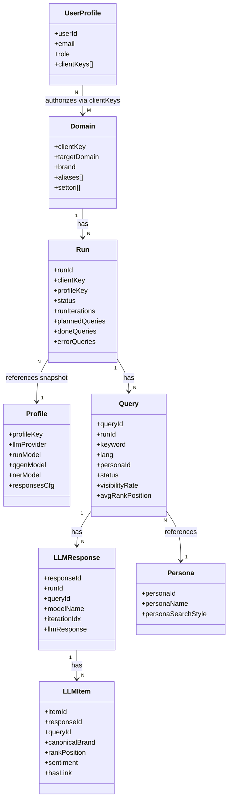
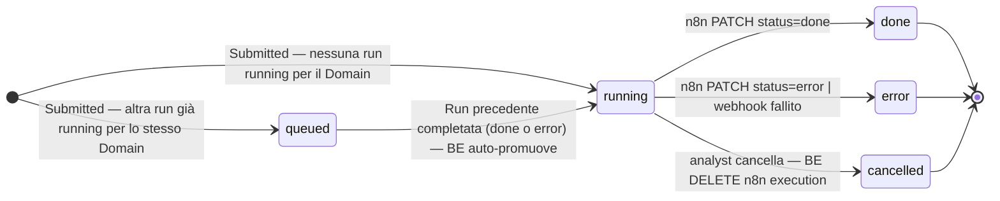
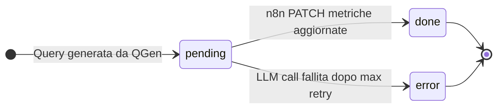

# L1 — Domain Model

> Conceptual model of the problem space: entities, relationships, invariants.
> Written at the **domain** level, not the database level. The DB schema lives in `L1_data/`; ERD and migrations cite this model.

---

## Core entities

Il sistema gestisce due categorie di entità:
- **Platform entities** — dati di configurazione e gestione della piattaforma (7 collection MongoDB)
- **Run data entities** — dati generati dalla pipeline di analisi n8n (4 collection MongoDB, prefisso `geo`)

---

### Platform entities

#### `Domain`

- **Purpose:** Rappresenta un brand/cliente da analizzare. È il contenitore logico di tutte le Run.
- **Key attributes:** `clientKey` (identificatore univoco e immutabile), `targetDomain`, `brand`, `aliases` (array — varianti del brand name da escludere dal ranking competitor), `settori` (array)
- **Lifecycle:** nessuno — entità stabile; clientKey non modificabile dopo la creazione

---

#### `UserProfile`

- **Purpose:** Mappa un utente Keycloak ai suoi clientKey autorizzati. Risolve OQ-005: il BE legge questa collection su ogni richiesta protetta per determinare i Domain accessibili dall'utente.
- **Key attributes:** `userId` (Keycloak `sub`, immutabile), `email`, `role` (analyst | admin), `clientKeys` (array di clientKey autorizzati)
- **Lifecycle:** gestito dall'admin tramite US-023

---

#### `Profile`

- **Purpose:** Configurazione riusabile di un provider LLM con i modelli da usare per QGen, Audit Worker e NER. Risolve OQ-007: spostato da geo-registry Drive a MongoDB per essere gestito dall'admin via UI.
- **Key attributes:** `profileKey`, `llmProvider` (openai | gemini | perplexity), `runModel`, `qgenModel`, `nerModel`, `responsesCfg` (params specifici del provider: reasoningEffort, searchContextSize, maxOutputTokens, maxToolCalls)
- **Lifecycle:** gestito dall'admin tramite US-025

---

### Run data entities (collection prefisso `geo`)

#### `Run` *(collection: georuns)*

- **Purpose:** Singola esecuzione della pipeline di analisi per un Domain. Contiene la configurazione snapshot al momento dell'avvio e i contatori aggregati di avanzamento.
- **Key attributes:** `runId` (formato: ISO-timestamp + targetDomain), `clientKey`, `profileKey` (snapshot), `runIterations`, `locales`, `keywords override`, `testMode`, `debugMode`, `reportFolderId`, `reportFiles[]` (URL file Drive, salvati da n8n via E-023), `plannedQueries`, `doneQueries`, `errorQueries`, `errorMessage`, `executionId` (n8n execution ID — catturato dalla risposta del webhook trigger, necessario per la cancellazione), `rankingSnapshot[]` (competitor ranking pre-calcolato da n8n Finalizer, salvato via E-023 al completamento — fonte diretta di E-011)
- **Lifecycle:** `queued → running → done | error | cancelled`
  - `queued`: creata quando c'è già una run `running` per lo stesso Domain (OQ-004)
  - `running`: promossa automaticamente dal BE quando la run precedente dello stesso Domain termina; `executionId` viene popolato
  - `done` / `error`: impostati da n8n via PATCH engine-API
  - `cancelled`: impostato dal BE dopo aver chiamato `DELETE /api/v1/executions/:executionId` su n8n (OQ-006)

---

#### `Query` *(collection: geoqueries)*

- **Purpose:** Singola domanda LLM generata dal QGen per la combinazione keyword × locale × persona. Tiene lo stato di elaborazione e le metriche di visibilità aggregate.
- **Key attributes:** `queryId`, `runId`, `keyword`, `lang`, `region`, `personaId`, `personaName`, `questionIdx`, `query` (testo), `status`, `iterationsProcessed`, `targetMentions`, `visibilityRate`, `avgRankPosition`, `linkRate`, `sentimentPositive/Neutral/Negative`, `lockedAt`, `lockOwner` (worker concurrency)
- **Lifecycle:** `pending → done | error`

---

#### `LLMResponse` *(collection: geollmresponses)*

- **Purpose:** Risposta grezza dell'LLM per una specifica iterazione di una Query. Contiene prompt completo, system prompt e testo della risposta.
- **Key attributes:** `responseId`, `runId`, `queryId`, `modelName`, `iterationIdx`, `promptText`, `systemPrompt`, `llmResponse`
- **Lifecycle:** immutabile dopo la creazione

---

#### `LLMItem` *(collection: geollmitems)*

- **Purpose:** Singola entità brand estratta via NER da una LLMResponse. Rappresenta una menzione di un brand con posizione, sentiment e link.
- **Key attributes:** `itemId`, `responseId`, `queryId`, `runId`, `canonicalBrand`, `rankPosition` (int), `sentiment` (positive | neutral | negative), `hasLink` (bool), `linkType`, `link` (URL)
- **Lifecycle:** immutabile dopo la creazione

---

### Entità di riferimento (non in MongoDB)

#### `Persona`

- **Purpose:** Profilo di ricerca simulato che guida intent e stile delle query generate dal QGen. Non è un utente della piattaforma — è un archetype dell'utente finale del brand analizzato.
- **Key attributes:** `personaId`, `personaName` (es. "Antonio - Traditional Devotee"), `personaDescription`, `personaSearchStyle`
- **Storage:** geo-registry JSONC su Google Drive (non in MongoDB); 7 personas per configurazione

---

## Relationships

| From | Relation | To | Cardinality | Notes |
|------|----------|-----|-------------|-------|
| `UserProfile` | authorizes access to | `Domain` | N:M | via `UserProfile.clientKeys[]` |
| `Domain` | has | `Run` | 1:N | |
| `Run` | references (snapshot) | `Profile` | N:1 | config copiata alla creazione della run |
| `Run` | has | `Query` | 1:N | |
| `Query` | references | `Persona` | N:1 | da geo-registry |
| `Query` | has | `LLMResponse` | 1:N | una per iterazione (runIterations) |
| `LLMResponse` | has | `LLMItem` | 1:N | 0:N — zero se l'LLM non menziona brand |

---

### Visual model (Mermaid)

---

### Lifecycle delle entità con stato

---

## Collection MongoDB — riepilogo

| Collection | Tipo | Creata da | Gestita da |
|------------|------|-----------|------------|
| `domains` | Platform | analyst (US-003) | analyst / admin |
| `userprofiles` | Platform | admin (US-023) | admin |
| `profiles` | Platform | admin (US-025) | admin |
| `georuns` | Run data | BE (US-008) | BE + n8n (PATCH) |
| `geoqueries` | Run data | n8n (via BE US-021) | n8n (PATCH US-020) |
| `geollmresponses` | Run data | n8n | immutabile |
| `geollmitems` | Run data | n8n (US-021) | immutabile |

---

## Invariants

- **`clientKey` è immutabile** dopo la creazione di un Domain.
- **Solo il BE crea Run** — n8n non scrive mai direttamente su `georuns`; può solo leggerle e aggiornarle tramite PATCH autenticati.
- **Solo n8n (service account) crea `LLMResponse` e `LLMItem`** — nessun utente umano può creare direttamente queste entità.
- **Un `LLMItem` appartiene sempre a una `LLMResponse`, `Query` e `Run` valide** — non esistono LLMItem orfani.
- **Lo status di `Run` e `Query` è unidirezionale** — non può retrocedere a uno stato precedente.
- **Una sola run per Domain può essere in stato `running` in un dato momento** — eventuali run aggiuntive vengono accodate in `queued` (OQ-004).
- **`georuns.executionId` deve essere popolato al momento del passaggio a `running`** — senza di esso la cancellazione via n8n API non è possibile.
- **n8n non può sovrascrivere lo stato `cancelled`** — se arriva un PATCH da n8n su una run già `cancelled`, il BE lo ignora.
- **`UserProfile.clientKeys[]` determina i Domain visibili a un utente** — il BE non espone mai Domain fuori da questo set (OQ-005).
- **`targetMentions` e le metriche in `geoqueries` sono derivate da `geollmitems`** — deve esistere coerenza tra i due livelli.

---

## Open modeling questions

- OQ-006 — Cancellazione run in corso (US-010): comportamento n8n e gestione run `queued` a valle
